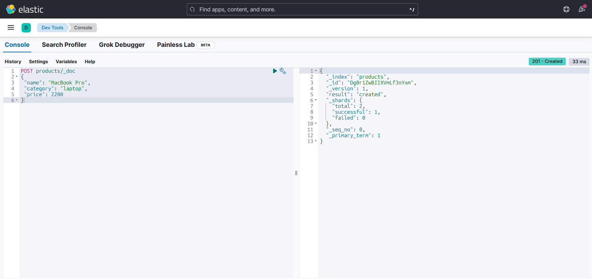
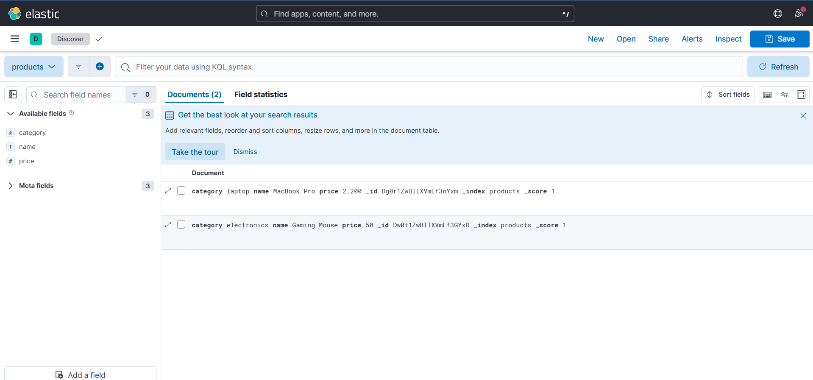

# Search Engine API

A scalable search API built with Node.js and Elasticsearch to index and retrieve data efficiently.

## Features
- Index documents
- Full-text search
- Filtering results
- Pagination
- Sorting results
- OpenAPI (Swagger) documentation

## Technologies
- Node.js: JavaScript runtime for building the API server
- Express: Web framework for Node.js
- Elasticsearch: Distributed search and analytics engine
- Docker: Containerization for Elasticsearch & Kibana
- Kibana: UI for visualizing Elasticsearch data and managing indices
- Swagger (swagger-ui-express, swagger-jsdoc): API documentation

## Project Structure

```
search-engine-api
│
├── src
│   ├── controllers      # API logic
│   ├── routes           # API endpoints
│   ├── services         # Business logic and Elasticsearch queries
│   └── elastic          # Elasticsearch client config
│
├── docker-compose.yml   # Docker setup for Elasticsearch & Kibana
├── package.json         # Node.js dependencies and scripts
├── .env                 # Environment variables
└── README.md            # Project documentation
```

## Getting Started

### Prerequisites
- Node.js (v18+ recommended)
- Docker (for Elasticsearch & Kibana)

### Setup
1. **Install dependencies:**
   ```bash
   npm install
   ```
2. **Start Elasticsearch & Kibana:**
   ```bash
   docker-compose up -d
   ```
   - This will start two containers:
     - **Elasticsearch** (http://localhost:9200): The search engine backend
     - **Kibana** (http://localhost:5601): The web UI for managing and visualizing Elasticsearch data
3. **Start the API server:**
   ```bash
   npm start
   ```
   - The API will run on [http://localhost:3000](http://localhost:3000)

### API Documentation
- Visit [http://localhost:3000/api-docs](http://localhost:3000/api-docs) for Swagger UI and try the endpoints interactively.

## Services Overview

- **Elasticsearch**: Stores and indexes your documents. Accessible at [http://localhost:9200](http://localhost:9200)
- **Kibana**: Visualizes and manages Elasticsearch data. Accessible at [http://localhost:5601](http://localhost:5601)
- **API Server**: Handles client requests, connects to Elasticsearch, and exposes REST endpoints. Accessible at [http://localhost:3000](http://localhost:3000)

## Example Use Cases
- Product search for e-commerce
- Blog post search
- User directory search

## Environment Variables
- `PORT`: API server port (default: 3000)
- `ELASTICSEARCH_URL`: Elasticsearch URL (default: http://localhost:9200)

## Docker Compose Details

The `docker-compose.yml` file defines two services:

- **elasticsearch**
  - Image: `docker.elastic.co/elasticsearch/elasticsearch:8.13.4`
  - Ports: `9200:9200`
  - Environment:
    - `discovery.type=single-node` (single-node mode)
    - `xpack.security.enabled=false` (disables security for local dev)
    - `ES_JAVA_OPTS=-Xms512m -Xmx512m` (limits JVM memory usage)

- **kibana**
  - Image: `docker.elastic.co/kibana/kibana:8.13.4`
  - Ports: `5601:5601`
  - Depends on: `elasticsearch`

Both services are connected via the `searchnet` Docker network.

---

Feel free to contribute or open issues!

## Examples of Using Kibana

### 1. Index a Document in Elasticsearch via Kibana Console

```json
POST products/_doc
{
  "name": "MacBook Pro",
  "category": "laptop",
  "price": 2200
}
```

**Expected response:**
```json
{
  "_index": "products",
  "_id": "<id>",
  "_version": 1,
  "result": "created",
  "_shards": { "total": 2, "successful": 1, "failed": 0 },
  "_seq_no": 0,
  "_primary_term": 1
}
```

### 2. View Documents in Kibana Discover

In the **Discover** tab of Kibana, select the `products` index to see the indexed documents:

| category    | name         | price |
|-------------|--------------|-------|
| laptop      | MacBook Pro  | 2200  |
| electronics | Gaming Mouse | 50    |

You can filter, sort, and explore fields in the graphical interface.

## Screenshots

### 1. Indexing a Document in Kibana Console



### 2. Viewing Documents in Kibana Discover


